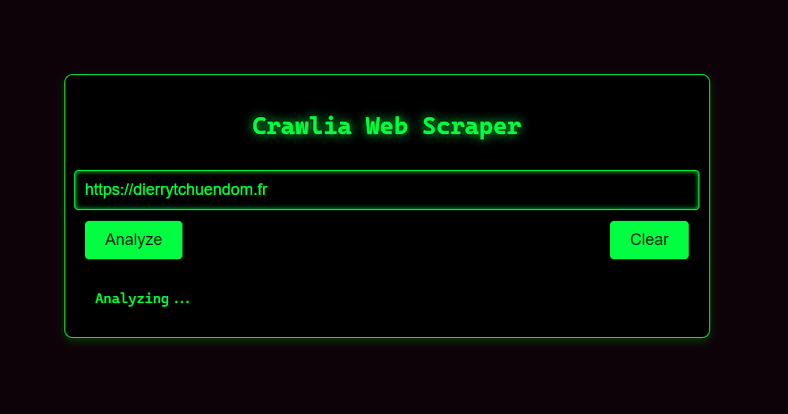
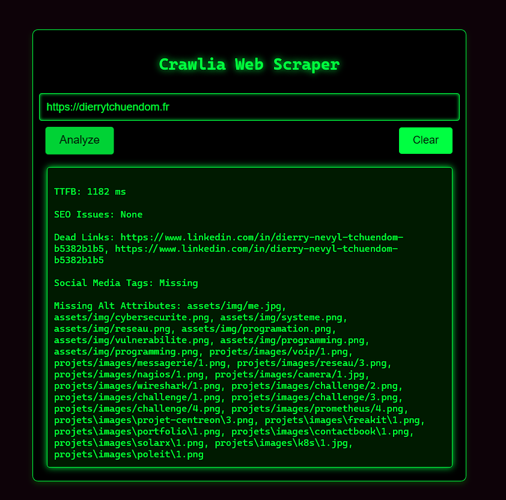

# Crawlia_NodeJS_Project

This is a simple web scrapping app made in node js.
The user interface contain just a simple input containing the URL you want to analyze.
Once the form submitted, the analyse starts.
Once the report generated,  it present  to the user !

## Analysing the page

crawlia analyse : 

```text
- TTFB ( response time from the server in ms ).
- Does the document has SEO attribute such as meta-description, h1, h2 etc… ?
- Does the page include deadlinks ? ( 404 urls in the page for example ).
- Social Media Tags
- Missing Alt Attributes
```

## How to get the code 
```
git clone https://github.com/Scarfacemoignon/Crawlia_NodeJS_Project.git
```

## How to execute the code 

#### Initialize the Project:
```
npm init -y
```

#### Install dependencies :
```
npm install express axios
```

#### Launch Application :
```
node server.js
```

Open your browser and go to :
```
http://localhost:3000
```
Enter a URL to analyze 

## Exemple 1
### Crawlia_NodeJS 


View the results.
## Exemple 2
### Results of the analysis or Scrapping



# Thanks for downloading.
